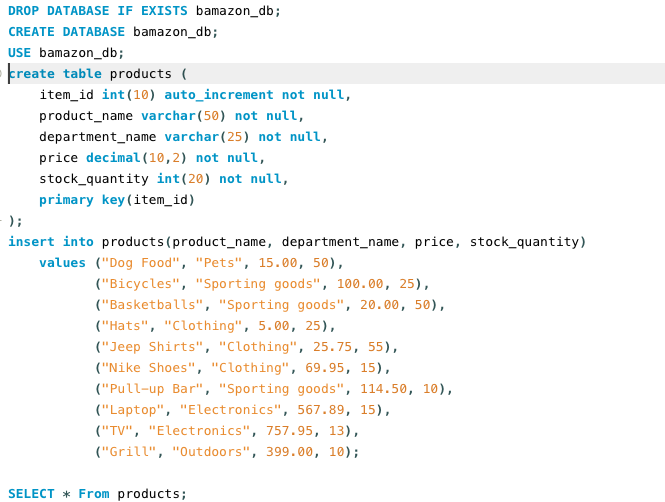
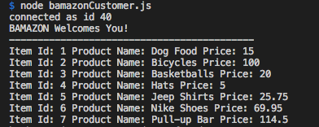
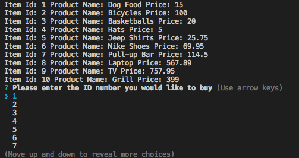
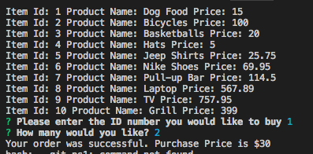
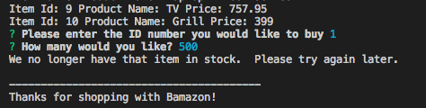

# Node.js-MySQL

## Created a database in MySQL workbench that created products. Those products included how many items, prices and item numbers. 

####Screenshot of my database setup with table.

----------------------------------------------
###Picture of bamazon welcome with ID, Product name and price.
----------------------------------------------

----------------------------------------------
###Picture of option of item you would like to buy.

----------------------------------------------
###Picture of how many you would like to buy after selecting the item.

----------------------------------------------
###Picture of what comment you get when the item is out of stock. When "out of stock you have to try back later"

