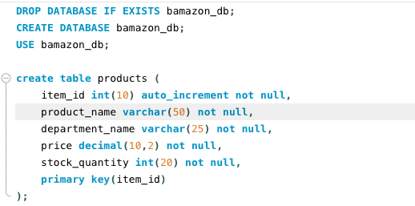
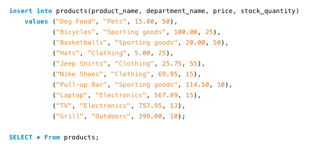

# Node.js-MySQL

## Created a database in MySQL workbench that created products. Those products included how many items, prices and item numbers. 

###Screenshot of my database setup with table.
---------------------------------------------

